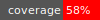

# is-enum

[](LICENSE)
[](https://badge.fury.io/rb/is-enum)
[](https://github.com/inat-get/is-enum/actions/workflows/ruby.yml) 


Enum types for Ruby

## Usage

```ruby
require 'is-enum'

class MyEnum < IS::Enum

  define :alpha, 1
  define :beta,  2
  define :b, alias: :beta

end
```
